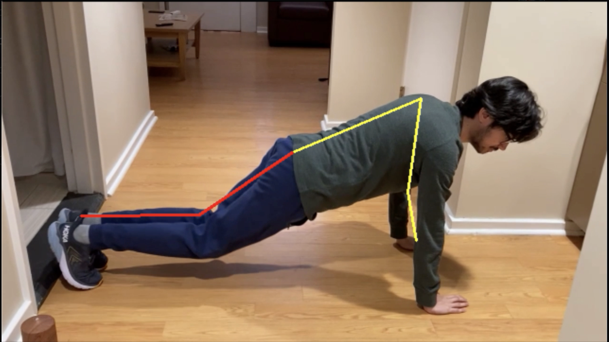

# trueform
hoohacks22 submission from Neil Phan (nnp3axx), Alip Arslan (aa8pss), Rohan Chandra (rc8yw) 

TrueForm is a body-tracking AI that determines whether a user is performing an exercise using the proper form.
By leveraging Tensorflow's MoveNet model and OpenCV, we are able to draw a skeleton around the user and determine 
the angles between different edges in the skeleton. We can then measure these angles and check whether they are in a pre-determined range or not. 
An example of this skeleton is shown below.

For example, in order to do a proper push-up, the user's back needs to be straight. Using out software we can determine whether the user's back 
is straight or not and then indicate via colors (green=best, orange=form starting to break, yellow=form is breaking even further, red=bad form) 
how their form is. Here is an example of the color tracking for a user (Alip Arslan) performing a push-up. 

Here is Alip with good form.

And here he is with bad form. Notice how his back has now turned red. 

